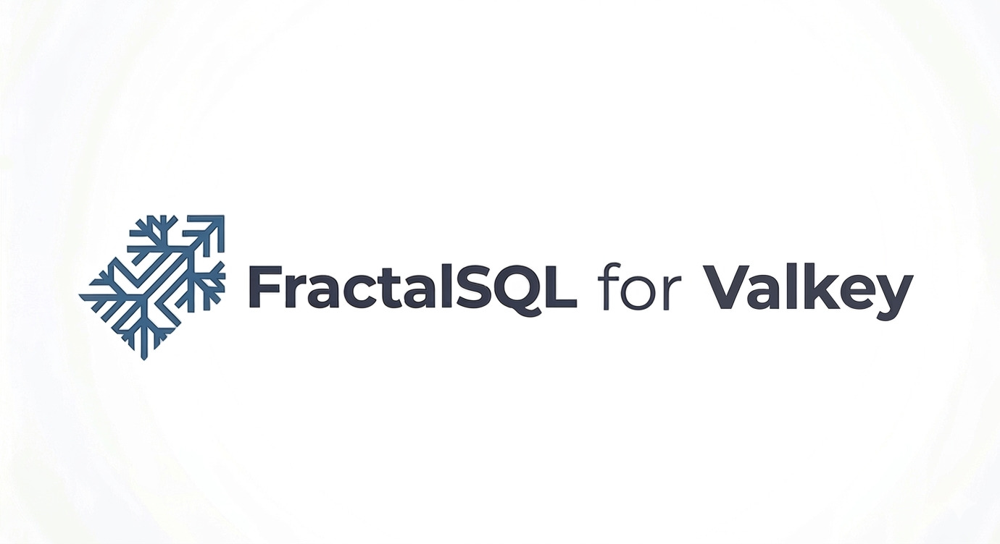

<p align="center">
  
</p>

# FractalSQL for Valkey

**Sub-millisecond semantic search as a Valkey module.**
A single `FRACTAL.SEARCH` command, a stored-BLOB corpus, a query
vector, and a RESP3 map back — all running inside the Valkey server
process, with LuaJIT statically linked into the module.

Valkey is the Linux Foundation fork of Redis (March 2024, post-SSPL
relicense). It preserves the `REDISMODULE_APIVER_1` module contract,
which is why **one `fractalsql.so` per arch** loads cleanly on
**Valkey 7.2 / 8.0 / 8.1**. The source is byte-identical to
[`redis-fractalsql`](https://github.com/FractalSQLabs/redis-fractalsql),
so the SQL-visible surface (`FRACTAL.SEARCH`, `FRACTALSQL.EDITION`,
`FRACTALSQL.VERSION`) and all end-user docs transfer 1:1 across the
two forks.

## Compatibility matrix

| Valkey version | Linux amd64 | Linux arm64 |
|----------------|-------------|-------------|
| Valkey 7.2     |      ✓      |      ✓      |
| Valkey 8.0     |      ✓      |      ✓      |
| Valkey 8.1     |      ✓      |      ✓      |

Linux-only. See "Why no Windows?" below.

## Why 2026

- **Semantic caching for LLMs.** Before hitting your language
  model, ask Valkey: *does this prompt already have an answer in
  the cache?* `FRACTAL.SEARCH` returns the closest-matching
  cached prompts in microseconds — zero network hop, zero
  serialization overhead, raw C touching raw RAM.
- **Valkey 8.x multi-threaded I/O.** The command is declared
  `readonly fast allow-stale`. Valkey 8.x's I/O threadpool
  scheduler dispatches `FRACTAL.SEARCH` to a worker thread,
  bypassing the main event loop. Each worker keeps its own
  LuaJIT state (`__thread`-local), so there is no global mutex
  in the fast path — throughput scales linearly with
  `io-threads`.
- **Upstash / ElastiCache Graviton.** ARM64 builds are first-class.
  Drop the `.so` into your managed Valkey deployment where modules
  are permitted and you're a restart away from fractal vector
  search.

## Production posture

- **One .so per arch, every major.** The module ABI
  (`REDISMODULE_APIVER_1`, aliased as `VALKEYMODULE_APIVER_1`) was
  preserved across the April 2024 fork from Redis and has held
  steady across 7.2 / 8.0 / 8.1. CI smoke-tests the **same**
  `fractalsql.so` inside live `valkey/valkey:7.2`, `:8.0`, and
  `:8.1` containers on every tag — that's the cross-major ABI
  proof.
- **Multi-arch**: native builds for **linux/amd64** and
  **linux/arm64** — AWS ElastiCache Graviton, Upstash ARM,
  Raspberry Pi, Apple Silicon via Docker Desktop.
- **Static LuaJIT.** `libluajit-5.1.a` (PIC-built from source) is
  linked into the module. No LuaJIT runtime dep — only glibc.
  `ldd fractalsql.so` should report nothing outside the glibc
  shortlist (`libc`, `libm`, `libdl`, `libpthread`, vDSO, ld-linux).
- **C++11 ABI hygiene.** Compiled with `-D_GLIBCXX_USE_CXX11_ABI=0`
  plus `-Wl,--exclude-libs,ALL`; no `__cxx11::basic_string` symbols
  in `nm -D -C` output.
- **Minimum glibc 2.38** — aligned with Ubuntu 24.04 / Debian 13 /
  RHEL 9 family.

---

## The command

```
FRACTAL.SEARCH <corpus_key> <query_blob> [<K>]
```

| Arg | Type | Notes |
| --- | --- | --- |
| `corpus_key` | Valkey STRING key | Packed little-endian float32 values, `N * dim * 4` bytes |
| `query_blob` | RESP bulk string | Packed little-endian float32 query vector, `dim * 4` bytes (dim is inferred) |
| `K`          | integer, optional | Top-k to return (default 10, clamped to [1, 10000]) |

Reply (RESP3 map; auto-downgrades to RESP2 array of pairs for
clients that don't speak RESP3):

```json
{
  "dim":        128,
  "n_corpus":   10000,
  "best_point": [0.601, 0.598, ...],
  "best_fit":   0.00009,
  "top_k": [
    {"idx": 42,   "dist": 0.012},
    {"idx": 1337, "dist": 0.019}
  ]
}
```

### Metadata commands

```
FRACTALSQL.EDITION     # -> "Community"
FRACTALSQL.VERSION     # -> "1.0.0"
```

Zero-key, readonly, safe under `MULTI` and on replicas.

### Zero-copy semantics

The corpus is read via `RedisModule_StringDMA` and cosine distance
is computed directly on the Valkey-owned memory cast as
`const float *`. The query is likewise accessed via
`RedisModule_StringPtrLen` with no intermediate copy. The only
allocation in the hot path is the double-precision decode of the
query for the SFS inner loop.

### Thread model

Command flags: `readonly fast allow-stale`.

- `readonly` — never writes keys; safe under replicas.
- `fast` — signals to Valkey's scheduler that the command is
  bounded enough to run outside the main event loop.
- `allow-stale` — replicas may serve under failover.

Each worker thread lazily constructs its own LuaJIT state on first
call (`__thread` storage) and never tears it down — threads in the
worker pool are long-lived, so we pay one state allocation per
worker and amortize forever after.

---

## Installation

### Debian / Ubuntu — `.deb`

```bash
sudo apt install ./valkey-fractalsql-amd64.deb
# Add to /etc/valkey/valkey.conf:
#     loadmodule /usr/lib/valkey/modules/fractalsql.so
sudo systemctl restart valkey-server
valkey-cli FRACTALSQL.EDITION     # -> "Community"
valkey-cli FRACTALSQL.VERSION     # -> "1.0.0"
```

Depends on `valkey-server`. Installs the module at
`/usr/lib/valkey/modules/fractalsql.so` and drops a sample config
snippet at `/etc/valkey/modules-available/fractalsql.conf`. The
post-install step prints the exact `loadmodule` directive. The
package does **not** auto-edit `valkey.conf`.

### RHEL / Fedora / Oracle Linux — `.rpm`

```bash
sudo rpm -i valkey-fractalsql-x86_64.rpm
```

Requires `valkey`. Same install path. The spec claims `%dir`
ownership of `/usr/lib/valkey/modules/` and
`/etc/valkey/modules-available/` since neither is owned by a base
package on stock RHEL-family installs.

### Live load (no config edit)

```bash
valkey-cli MODULE LOAD /usr/lib/valkey/modules/fractalsql.so
```

Does not persist across server restarts — use the config path
above for production.

---

## Why no Windows?

> Valkey upstream does not publish Windows binaries and the project's
> CI targets Linux and macOS only. A Windows port would require
> building Valkey itself from source on WSL2 or MinGW — not a
> configuration we attempt to support. If you need Redis-compatible
> vector search on Windows, use
> [`redis-fractalsql`](https://github.com/FractalSQLabs/redis-fractalsql)
> against [Memurai](https://www.memurai.com/).

---

## Example usage

```bash
# Load the module (either in config, or live).
valkey-cli MODULE LOAD /usr/lib/valkey/modules/fractalsql.so

# Store a corpus of 10_000 × 128-dim float32 embeddings as a BLOB.
python3 -c "import numpy as np, sys; \
  sys.stdout.buffer.write(np.random.randn(10000, 128).astype(np.float32).tobytes())" \
  | valkey-cli -x SET my_corpus

# Query.
python3 -c "import numpy as np, sys; \
  sys.stdout.buffer.write(np.random.randn(128).astype(np.float32).tobytes())" \
  > /tmp/q.bin
valkey-cli FRACTAL.SEARCH my_corpus "$(cat /tmp/q.bin)" 10
```

Python (`redis-py` speaks the Valkey wire protocol unchanged):

```python
import redis
import numpy as np

r = redis.Redis(protocol=3)

corpus = np.random.randn(10_000, 128).astype(np.float32)
r.set("my_corpus", corpus.tobytes())

query = np.random.randn(128).astype(np.float32)
resp = r.execute_command("FRACTAL.SEARCH", "my_corpus", query.tobytes(), 10)
# {'dim': 128, 'n_corpus': 10000, 'best_point': [...],
#  'best_fit': 0.001, 'top_k': [{'idx': 42, 'dist': 0.012}, ...]}
```

---

## Building from source

```bash
./build.sh amd64   # -> dist/amd64/fractalsql.so (static LuaJIT, -O3)
./build.sh arm64   # -> dist/arm64/fractalsql.so (via QEMU)
```

The Dockerfile:

1. Builds LuaJIT 2.1 from the GitHub mirror with `BUILDMODE=static
   XCFLAGS="-fPIC"` into `/opt/luajit`.
2. Shallow-clones the Valkey source at a pinned tag (default
   `8.1.0`) and harvests `src/redismodule.h` into the build context.
3. Compiles and links `fractalsql.so` with the hardened flag set
   (`-fvisibility=default`, `-Wl,--gc-sections`,
   `-Wl,--exclude-libs,ALL`, `-static-libgcc`, `-static-libstdc++`).
4. Runs `docker/assert_so.sh` inside the builder stage: `ldd`
   shortlist enforced, `__cxx11::basic_string` symbols forbidden,
   size ceiling enforced, `RedisModule_OnLoad` required in `.dynsym`.

For quick local iteration (dynamic-link LuaJIT, faster feedback):

```bash
sudo apt install -y build-essential libluajit-5.1-dev pkg-config curl
make                 # fetches redismodule.h from valkey-io/valkey if missing
sudo make install
```

`make distclean` re-fetches `include/redismodule.h` on next build.

---

## Third-Party Components

The module bundles pre-compiled LuaJIT bytecode derived from the
Stochastic Fractal Search reference implementation (Salimi, 2014,
BSD-3-Clause) and statically links LuaJIT (MIT). See
[`LICENSE-THIRD-PARTY`](LICENSE-THIRD-PARTY) for full attribution.

---

## Architectural notes

**SFS under the hood.** The module runs Sniper-mode SFS
(`walk=0.5`, pop 50, 30 iters, diffusion 2) to find a continuous
best point for the query in `[-1, 1]^dim`, then ranks the corpus
BLOB by cosine distance to that best point and returns top-k.
For semantic caching this gives you "nearest cache key, even if
the literal prompt drifted" semantics.

**RESP3 awareness.** Replies use `RedisModule_ReplyWithMap` on
Valkey 7.0+ (i.e. every supported major). If the client negotiated
RESP2, Valkey automatically flattens the map to an array of
`[key, value, ...]`. No client change required.

**No LuaJIT parser at runtime.** The optimizer ships as
pre-stripped LuaJIT bytecode embedded in the `.so` as a C byte
array. Loading is a `luaL_loadbuffer` over in-memory bytes — no
tokenizer, no parser, no AST walk. The bytecode header contains
no source strings.

---

## Status of advanced features

Shipping v1.0: the scalar command and metadata triad. Roadmap:

- **Keyspace scan variant** — iterate over a SET of keys instead
  of a single BLOB, for corpora that don't fit one key.
- **Valkey module catalog submission** — separate iteration against
  `valkey-io/valkey-packaging`.

---

## License

MIT. See [`LICENSE`](LICENSE). Third-party components in
[`LICENSE-THIRD-PARTY`](LICENSE-THIRD-PARTY).

---

[github.com/FractalSQLabs](https://github.com/FractalSQLabs) · Issues and
PRs welcome.
